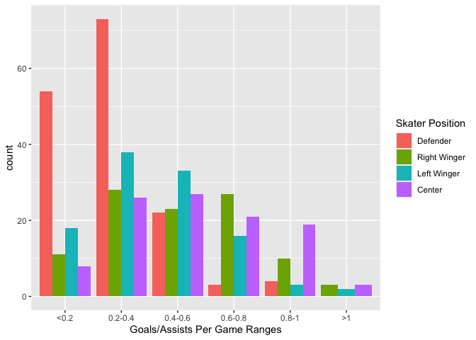
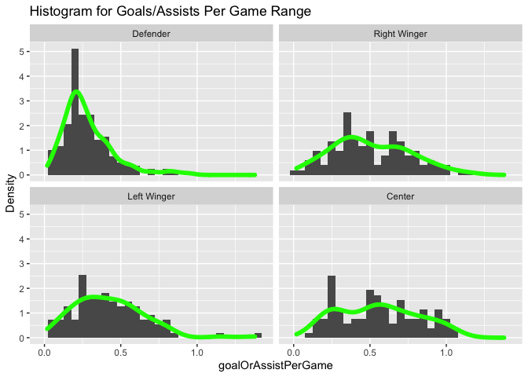
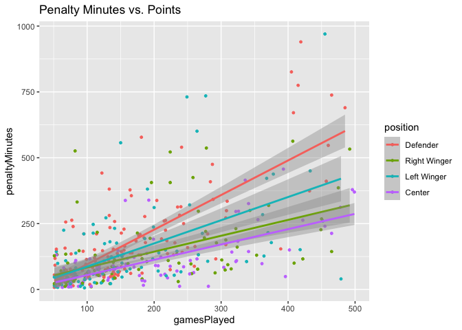
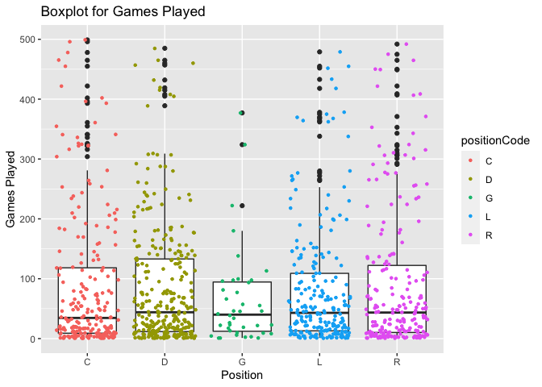
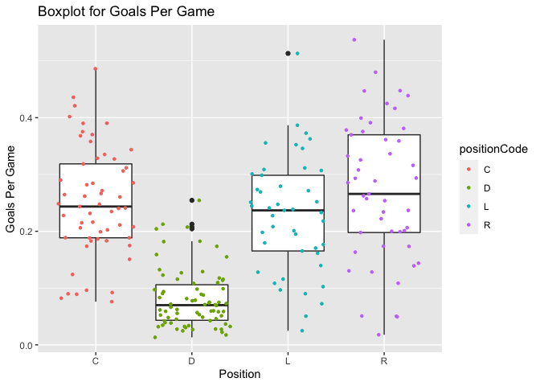

Project 1
================
Nermin Bibic
6/20/2021

-   [Reading and Summarizing data from the National Hockey League’s
    (NHL)
    API](#reading-and-summarizing-data-from-the-national-hockey-leagues-nhl-api)
    -   [Packages required to run code](#packages-required-to-run-code)
    -   [Functions to contact the NHL records
        API](#functions-to-contact-the-nhl-records-api)
        -   [Function returning id, firstSeasonId, lastSeasonId, and
            name of every team in the history of the
            NHL.](#function-returning-id-firstseasonid-lastseasonid-and-name-of-every-team-in-the-history-of-the-nhl)
        -   [Function returning total stats for every franchise (ex:
            roadTies, roadWins,
            etc.)](#function-returning-total-stats-for-every-franchise-ex-roadties-roadwins-etc)
        -   [Function returning season records for a specific
            franchise](#function-returning-season-records-for-a-specific-franchise)
        -   [Function returning season records for a specific
            franchise](#function-returning-season-records-for-a-specific-franchise-1)
        -   [Function returning skater records for a specific
            franchise](#function-returning-skater-records-for-a-specific-franchise)
        -   [Function returning admininstration history and retired
            numbers](#function-returning-admininstration-history-and-retired-numbers)
    -   [Function to contact the NHL stats API for the
        ?expand=team.stats
        modifier.](#function-to-contact-the-nhl-stats-api-for-the-expandteamstats-modifier)
    -   [NHL Data Wrapper function](#nhl-data-wrapper-function)
    -   [Exploratory Data Analysis](#exploratory-data-analysis)
        -   [Contingency Tables](#contingency-tables)
        -   [Numerical Summaries of Outfield Player Performance
            Data](#numerical-summaries-of-outfield-player-performance-data)
        -   [Barplot of Goals or Assists Per Game
            Range](#barplot-of-goals-or-assists-per-game-range)
        -   [Kernel Smoother Histogram for Goals or Assists Per
            Game](#kernel-smoother-histogram-for-goals-or-assists-per-game)
        -   [Scatterplot of Games Played and Penalty
            Minutes](#scatterplot-of-games-played-and-penalty-minutes)
        -   [Boxplot for Games Played by
            Position](#boxplot-for-games-played-by-position)
        -   [Boxplot for Goals Per Game](#boxplot-for-goals-per-game)

# Reading and Summarizing data from the National Hockey League’s (NHL) API

### Packages required to run code

``` r
library(knitr)
library(tidyverse)
library(httr)
library(jsonlite)
library(ggplot2)
library(readr)
library(DT)
```

## Functions to contact the NHL records API

API Sources:

``` r
baseURLRecords <- "https://records.nhl.com/site/api/"
baseURLStats <- "https://statsapi.web.nhl.com/api/v1/teams"
```

The below functions return NHL records in well-formatted, parsed data
frames, with options to specify the franchise of choice by both name and
ID number.

### Function returning id, firstSeasonId, lastSeasonId, and name of every team in the history of the NHL.

``` r
franchises <- function() {
  URL <- paste0(baseURLRecords, 'franchise')
  franchiseRAW <- RCurl::getURL(URL)
  franchiseDF <- fromJSON(franchiseRAW, flatten=TRUE)
  franchiseDF <- as_tibble(franchiseDF$data)
  franchiseDF <- franchiseDF %>% select(id,
                                        mostRecentTeamId,
                                        fullName,
                                        firstSeasonId,
                                        lastSeasonId)
  return(franchiseDF)
}
```

### Function returning total stats for every franchise (ex: roadTies, roadWins, etc.)

``` r
franchiseTeamTotals <- function() {
  URL <- paste0(baseURLRecords, 'franchise-team-totals')
  franchiseTeamTotalsRAW <- RCurl::getURL(URL)
  franchiseTeamTotalsDF <- fromJSON(franchiseTeamTotalsRAW, flatten=TRUE)
  franchiseTeamTotalsDF <- as_tibble(franchiseTeamTotalsDF$data)
  return(franchiseTeamTotalsDF)
}
```

### Function returning season records for a specific franchise

``` r
seasonRecords <- function(team, method = c('franchise_id', 'team_id', 'team_name')) {
  if(missing(team)) {
    stop('Please specify team')
  }
  if(missing(method)) {
    stop('Please specify method. Acceptable methods:\n\nfranchise_id\nteam_id\nteam_name')
  }
  if (method == 'team_id') {
    team = select(filter(franchises(), mostRecentTeamId == team), id)$id
  } else if (method == 'team_name') {
    team = select(filter(franchises(), fullName == team), id)$id
  }
  URL <- paste0(baseURLRecords, 'franchise-season-records?cayenneExp=franchiseId=', team)
  seasonRecordsRAW <- RCurl::getURL(URL)
  seasonRecordsDF <- fromJSON(seasonRecordsRAW, flatten=TRUE)
  seasonRecordsDF <- as_tibble(seasonRecordsDF$data)
  return(seasonRecordsDF)
}
```

### Function returning season records for a specific franchise

``` r
goalieRecords <- function(team, method = c('franchise_id', 'team_id', 'team_name')) {
  if(missing(team)) {
    stop('Please specify team')
  }
  if(missing(method)) {
    stop('Please specify method. Acceptable methods:\n\nfranchise_id\nteam_id\nteam_name')
  }
  if (method == 'team_id') {
    team = select(filter(franchises(), mostRecentTeamId == team), id)$id
  } else if (method == 'team_name') {
    team = select(filter(franchises(), fullName == team), id)$id
  }
  URL <- paste0(baseURLRecords, 'franchise-goalie-records?cayenneExp=franchiseId=', team)
  goalieRecordsRAW <- RCurl::getURL(URL)
  goalieRecordsDF <- fromJSON(goalieRecordsRAW, flatten=TRUE)
  goalieRecordsDF <- as_tibble(goalieRecordsDF$data)
  return(goalieRecordsDF)
}
```

### Function returning skater records for a specific franchise

``` r
skaterRecords <- function(team, method = c('franchise_id', 'team_id', 'team_name')) {
  if(missing(team)) {
    stop('Please specify team')
  }
  if(missing(method)) {
    stop('Please specify method. Acceptable methods:\n\nfranchise_id\nteam_id\nteam_name')
  }
  if (method == 'team_id') {
    team = select(filter(franchises(), mostRecentTeamId == team), id)$id
  } else if (method == 'team_name') {
    team = select(filter(franchises(), fullName == team), id)$id
  }
  URL <- paste0(baseURLRecords, 'franchise-skater-records?cayenneExp=franchiseId=', team)
  skaterRecordsRAW <- RCurl::getURL(URL)
  skaterRecordsDF <- fromJSON(skaterRecordsRAW, flatten=TRUE)
  skaterRecordsDF <- as_tibble(skaterRecordsDF$data)
  return(skaterRecordsDF)
}
```

### Function returning admininstration history and retired numbers

``` r
adminHistory <- function(team, method = c('franchise_id', 'team_id', 'team_name')) {
  if(missing(team)) {
    stop('Please specify team')
  }
  if(missing(method)) {
    stop('Please specify method. Acceptable methods:\n\nfranchise_id\nteam_id\nteam_name')
  }
  if (method == 'franchise_id') {
    team = select(filter(franchises(), id == team), mostRecentTeamId)$mostRecentTeamId
  } else if (method == 'team_name') {
    team = select(filter(franchises(), fullName == team), mostRecentTeamId)$mostRecentTeamId
  }
  URL <- paste0(baseURLRecords, 'franchise-detail?cayenneExp=mostRecentTeamId=', team)
  adminHistoryRAW <- RCurl::getURL(URL)
  adminHistoryDF <- fromJSON(adminHistoryRAW, flatten=TRUE)
  adminHistoryDF <- as_tibble(adminHistoryDF$data)
  return(adminHistoryDF)
}
```

## Function to contact the NHL stats API for the ?expand=team.stats modifier.

This function returns team stats. If no team is specified (by running
the function as “teamStats()”), this function returns stats for all
teams. If a team is specified, either by franchise ID, team ID, or team
name, this function returns a single row of stats data. The stats data
contain both raw values for each data point as well as ranks for the
data points.

``` r
teamStats <- function(team, method = c('franchise_id', 'team_id', 'team_name')) {
  
  if (missing(team)) {
    
    URL <- paste0(baseURLStats, '?expand=team.stats')
    teamStatsRAW <- RCurl::getURL(URL)
    teamStatsDF <- fromJSON(teamStatsRAW, flatten=TRUE)
    teamStatsList <- teamStatsDF$teams$teamStats
    # Remove NULL objects
    teamStatsList <- teamStatsList[-which(sapply(teamStatsList, is.null))]
    # Initialize empty list, to be filled with single-row tibbles
    allTeamsStats <- list()
    for (i in teamStatsList) {
      teamStatsSplits <- as_tibble(as.data.frame(i$splits))
      # Split raw value and rank data
      teamStatsValues <- teamStatsSplits[1, ]
      teamStatsRanks <- select(teamStatsSplits[2, ], -c('team.id', 'team.name', 'team.link'))
      # Clean up column names; remove prefix
      colnames(teamStatsValues) <- gsub("stat.", "", colnames(teamStatsValues))
      colnames(teamStatsRanks) <- gsub("Rank", "", colnames(teamStatsRanks))
      colnames(teamStatsRanks) <- gsub("stat.", "", colnames(teamStatsRanks))
      # Distinguish rank data
      colnames(teamStatsRanks) <- paste0(colnames(teamStatsRanks), 'Rank')
      # Drop NA columns
      teamStatsValues <- teamStatsValues[, colSums(is.na(teamStatsValues)) != nrow(teamStatsValues)]
      teamStatsRanks <- teamStatsRanks[, colSums(is.na(teamStatsRanks)) != nrow(teamStatsRanks)]
      # Combine values and ranks into one row
      teamStatsBind <- as_tibble(cbind(teamStatsValues, teamStatsRanks))
      allTeamsStats[[length(allTeamsStats) + 1]] <- teamStatsBind
    }
    # combine all tibbles in resulting list into one tibble
    allTeamsStats <- bind_rows(allTeamsStats)
    return(allTeamsStats)

  } else {
    
    if(missing(team)) {
      stop('Please specify team')
    }
    if(missing(method)) {
      stop('Please specify method. Acceptable methods:\n\nfranchise_id\nteam_id\nteam_name')
    }
    if (method == 'franchise_id') {
      team = select(filter(franchises(), id == team), mostRecentTeamId)$mostRecentTeamId
    } else if (method == 'team_name') {
      team = select(filter(franchises(), fullName == team), mostRecentTeamId)$mostRecentTeamId
    }
    URL <- paste0(baseURLStats, '/', team, '?expand=team.stats')
    teamStatsRAW <- RCurl::getURL(URL)
    teamStatsDF <- fromJSON(teamStatsRAW, flatten=TRUE)
    # Choose 'teamStats' object in JSON
    teamStatsDF <- as_tibble(teamStatsDF$teams$teamStats[[1]], .name_repair = 'minimal')
    teamStatsSplits <- as_tibble(as.data.frame(teamStatsDF$splits))
    # Split raw value and rank data
    teamStatsValues <- teamStatsSplits[1, ]
    teamStatsRanks <- select(teamStatsSplits[2, ], -c('team.id', 'team.name', 'team.link'))
    # Clean up column names; remove prefix
    colnames(teamStatsValues) <- gsub("stat.", "", colnames(teamStatsValues))
    colnames(teamStatsRanks) <- gsub("Rank", "", colnames(teamStatsRanks))
    colnames(teamStatsRanks) <- gsub("stat.", "", colnames(teamStatsRanks))
    # Distinguish rank data
    colnames(teamStatsRanks) <- paste0(colnames(teamStatsRanks), 'Rank')
    # Drop NA columns
    teamStatsValues <- teamStatsValues[, colSums(is.na(teamStatsValues)) != nrow(teamStatsValues)]
    teamStatsRanks <- teamStatsRanks[, colSums(is.na(teamStatsRanks)) != nrow(teamStatsRanks)]
    # Combine values and ranks into one row
    teamStatsBind <- as_tibble(cbind(teamStatsValues, teamStatsRanks))
    return(teamStatsBind)
    
  }
  
}
```

## NHL Data Wrapper function

This wrapper function is a one-stop-shop for the user to access any of
the API endpoints above. This function simply calls the appropriate
endpoint as per the users request, including any modifiers, team IDs,
etc.

``` r
NHLData <- function(target_data = c('franchises', 'team_totals', 'season_records',
                                    'goalie_records', 'skater_records',
                                    'admin_history', 'team_stats'),...) {
  switch(target_data,
           franchises = franchises(),
           team_totals = franchiseTeamTotals(),
           season_records = seasonRecords(...),
           goalie_records = goalieRecords(...),
           skater_records = skaterRecords(...),
           admin_history = adminHistory(...),
           team_stats = teamStats(...),
           stop("Please use valid argument located in function definition line.")
  )
}
```

## Exploratory Data Analysis

I chose New York Rangers player data for exploratory data analysis. In
this step, I am using the wrapper function to call NHL player data.

``` r
rangersSkaterRecords <- NHLData('skater_records', 3, 'team_id')
rangersGoalieRecords <- NHLData('goalie_records', 3, 'team_id')
# Combine skaters and goalies regardless of different sets of columns
rangersPlayerRecords <- bind_rows(rangersSkaterRecords, rangersGoalieRecords)
```

### Contingency Tables

Here is a two-way contingency table between position and games played
showing the frequency of each category.

A great majority of players regardless of position that have played for
the New York Rangers played less than 100 games. Very few players played
over 300 games.

``` r
rangersPlayerRecords$gamesPlayedRange <- cut(rangersPlayerRecords$gamesPlayed,
                                             c(0, 100, 200, 300, 400, 500,
                                               max(rangersPlayerRecords$gamesPlayed)))
levels(rangersPlayerRecords$gamesPlayedRange) = c("<100", "101-200", "201-300",
                                                  "301-400", "401-500", ">500")

rangersPlayerRecords$position <- as.factor(rangersPlayerRecords$positionCode)
levels(rangersPlayerRecords$position) <- list("Goalie" = "G",
                                              "Defender" = "D",
                                              "Right Winger" = "R",
                                              "Left Winger" = "L",
                                              "Center" = "C")

twoWayTab <- table(rangersPlayerRecords$position,
                   rangersPlayerRecords$gamesPlayedRange)
kable(twoWayTab, caption = 'Position and Games Played')
```

|              | &lt;100 | 101-200 | 201-300 | 301-400 | 401-500 | &gt;500 |
|:-------------|--------:|--------:|--------:|--------:|--------:|--------:|
| Goalie       |      34 |       3 |       1 |       2 |       0 |       3 |
| Defender     |     205 |      57 |      24 |       5 |       9 |      13 |
| Right Winger |     148 |      28 |      16 |      10 |       8 |       7 |
| Left Winger  |     164 |      34 |      14 |       7 |       5 |       8 |
| Center       |     159 |      29 |      15 |      14 |       8 |       8 |

Position and Games Played

Here is a three-way contingency table. We are obtaining bivariate info
form this three-dimensional array. First we are showing a two-way
contingency table between position and games played for inactive
players, and then a two-way contingency table between position and games
played for active players.

When compared to the contingency table for inactive players, the number
of active defenders that played over 100 games is larger than the number
that played under 100 games. This indicates the current New York Rangers
team has a more experienced defense than usual.

``` r
threeWayTab <- table(rangersPlayerRecords$position,
                     rangersPlayerRecords$gamesPlayedRange,
                     rangersPlayerRecords$activePlayer)
kable(threeWayTab[ , ,1], caption = "For inactive players:")
```

|              | &lt;100 | 101-200 | 201-300 | 301-400 | 401-500 | &gt;500 |
|:-------------|--------:|--------:|--------:|--------:|--------:|--------:|
| Goalie       |      31 |       3 |       1 |       2 |       0 |       2 |
| Defender     |     195 |      47 |      22 |       4 |       9 |      11 |
| Right Winger |     145 |      27 |      15 |       9 |       7 |       6 |
| Left Winger  |     159 |      32 |      12 |       7 |       5 |       7 |
| Center       |     144 |      26 |      13 |      10 |       8 |       7 |

For inactive players:

``` r
kable(threeWayTab[ , ,2], caption = "For active players:")
```

|              | &lt;100 | 101-200 | 201-300 | 301-400 | 401-500 | &gt;500 |
|:-------------|--------:|--------:|--------:|--------:|--------:|--------:|
| Goalie       |       3 |       0 |       0 |       0 |       0 |       1 |
| Defender     |      10 |      10 |       2 |       1 |       0 |       2 |
| Right Winger |       3 |       1 |       1 |       1 |       1 |       1 |
| Left Winger  |       5 |       2 |       2 |       0 |       0 |       1 |
| Center       |      15 |       3 |       2 |       4 |       0 |       1 |

For active players:

Here is a two-way contingency table between position and goals/assists
per game. I dropped all players who played 50 or less games so the
goal/assist per game proficiency is more accurate (a player who played 1
game and scored 1 goal would have a rate of 1 goal/assist per game and
would appear to be the most proficient scorer; for this reason I am
dropping players who didn’t play many games).

Defenders have a much lower attacking contribution rate (goals or
assists per game) in contrast to wingers and centers. The rate among
either of the left or right wingers and centers are very similar.

``` r
rangersPlayerRecords$goalOrAssistPerGame <- (rangersPlayerRecords$goals +
                                             rangersPlayerRecords$assists) /
                                            rangersPlayerRecords$gamesPlayed

rangersPlayerRecords <- droplevels(rangersPlayerRecords)

# Count only outfield players who played over 50 games, and convert NA values to 0
rangersPlayerRecords <- rangersPlayerRecords %>% filter(gamesPlayed > 50,
                                                        !is.na(goalOrAssistPerGame),
                                                        positionCode != 'G')

# Create goals/assist per game ranges
rangersPlayerRecords$GAPerGameRange <- cut(rangersPlayerRecords$goalOrAssistPerGame,
                                           c(0, .2, .4, .6, .8, 1,
                                             max(rangersPlayerRecords$goalOrAssistPerGame)))
levels(rangersPlayerRecords$GAPerGameRange) = c("<0.2", "0.2-0.4", "0.4-0.6",
                                                  "0.6-0.8", "0.8-1", ">1")

twoWayTab <- table(rangersPlayerRecords$position,
                   rangersPlayerRecords$GAPerGameRange)
kable(twoWayTab, caption = "Position and Goal/Assist Per Game")
```

|              | &lt;0.2 | 0.2-0.4 | 0.4-0.6 | 0.6-0.8 | 0.8-1 | &gt;1 |
|:-------------|--------:|--------:|--------:|--------:|------:|------:|
| Goalie       |       0 |       0 |       0 |       0 |     0 |     0 |
| Defender     |      54 |      73 |      22 |       3 |     4 |     0 |
| Right Winger |      11 |      28 |      23 |      27 |    10 |     3 |
| Left Winger  |      18 |      38 |      33 |      16 |     3 |     2 |
| Center       |       8 |      26 |      27 |      21 |    19 |     3 |

Position and Goal/Assist Per Game

### Numerical Summaries of Outfield Player Performance Data

The summary statistics for each of the variables are grouped below
separately, by the outfield positions.

I created two new variables for goals per game and assists per game.

``` r
rangersPlayerRecords$goalsPerGame <- rangersPlayerRecords$goals /
                                     rangersPlayerRecords$gamesPlayed
rangersPlayerRecords$assistsPerGame <- rangersPlayerRecords$assists /
                                       rangersPlayerRecords$gamesPlayed

# Subset by columns we want to analyze
rangersPlayerStats <- rangersPlayerRecords[ , c("gamesPlayed",
                                                "goalsPerGame",
                                                "assistsPerGame",
                                                "goalOrAssistPerGame",
                                                "position")]

# Function for summary statistics for the numerical columns
summarizePositions <- function(df, pos) {
  dfFiltered <- filter(df, position == pos)[, -5]
  kable(do.call(cbind, lapply(dfFiltered, summary, digits = 3)),
        caption = paste("Summary of Position", pos))
}
summarizePositions(rangersPlayerStats, "Defender")
```

|         | gamesPlayed | goalsPerGame | assistsPerGame | goalOrAssistPerGame |
|:--------|------------:|-------------:|---------------:|--------------------:|
| Min.    |          51 |       0.0000 |         0.0196 |              0.0294 |
| 1st Qu. |          79 |       0.0320 |         0.1320 |              0.1830 |
| Median  |         144 |       0.0567 |         0.1890 |              0.2410 |
| Mean    |         210 |       0.0657 |         0.2160 |              0.2810 |
| 3rd Qu. |         238 |       0.0879 |         0.2690 |              0.3610 |
| Max.    |        1160 |       0.2540 |         0.7640 |              0.9450 |

Summary of Position Defender

``` r
summarizePositions(rangersPlayerStats, "Center")
```

|         | gamesPlayed | goalsPerGame | assistsPerGame | goalOrAssistPerGame |
|:--------|------------:|-------------:|---------------:|--------------------:|
| Min.    |          53 |        0.037 |         0.0476 |               0.111 |
| 1st Qu. |          90 |        0.131 |         0.1960 |               0.299 |
| Median  |         174 |        0.204 |         0.3340 |               0.548 |
| Mean    |         227 |        0.214 |         0.3390 |               0.553 |
| 3rd Qu. |         322 |        0.285 |         0.4510 |               0.740 |
| Max.    |         945 |        0.486 |         0.8210 |               1.060 |

Summary of Position Center

``` r
summarizePositions(rangersPlayerStats, "Right Winger")
```

|         | gamesPlayed | goalsPerGame | assistsPerGame | goalOrAssistPerGame |
|:--------|------------:|-------------:|---------------:|--------------------:|
| Min.    |          51 |        0.000 |         0.0102 |              0.0182 |
| 1st Qu. |          82 |        0.131 |         0.1890 |              0.3360 |
| Median  |         141 |        0.202 |         0.2650 |              0.4650 |
| Mean    |         211 |        0.225 |         0.2810 |              0.5060 |
| 3rd Qu. |         292 |        0.302 |         0.3850 |              0.6770 |
| Max.    |        1060 |        0.608 |         0.7040 |              1.1500 |

Summary of Position Right Winger

``` r
summarizePositions(rangersPlayerStats, "Left Winger")
```

|         | gamesPlayed | goalsPerGame | assistsPerGame | goalOrAssistPerGame |
|:--------|------------:|-------------:|---------------:|--------------------:|
| Min.    |        51.0 |       0.0179 |         0.0147 |              0.0536 |
| 1st Qu. |        75.2 |       0.1100 |         0.1370 |              0.2550 |
| Median  |       134.0 |       0.1820 |         0.2030 |              0.3980 |
| Mean    |       194.0 |       0.1900 |         0.2330 |              0.4230 |
| 3rd Qu. |       238.0 |       0.2470 |         0.3060 |              0.5580 |
| Max.    |       841.0 |       0.5130 |         0.9370 |              1.3800 |

Summary of Position Left Winger

Looking at the mean and medians for the above summary data, it appears
skaters on the right wing are more effective at scoring and assisting
goals than those on the left wing. As expected, centers (the main
attacking position) have the highest mean and median goal or assist per
game.

### Barplot of Goals or Assists Per Game Range

Each of the below bar graphs show counts based on two variables. These
bar graphs are side-by-side bar plots, allowing us to compare counts
between more than one factor.

The bars for non-defenders are fairly symmetrical for the range of 0 to
1 goals/assists per game, while for defenders it is clearly
right-skewed. Centers seem to still hold well in the 0.8-1 goal/assist
per game range unlike the wingers; there are almost as many centers in
this range as there are centers in the 0.6-0.8 range. This indicates
centers are probably the main weapon of attack in hockey, as they seem
most prolific in making goals happen either directly or indirectly
(assists).

``` r
g <- ggplot(rangersPlayerRecords, aes(x = GAPerGameRange))
g + geom_bar(aes(fill = position), position = "dodge") +
    labs(x = "Goals/Assists Per Game Ranges") +
    scale_fill_discrete(name = "Skater Position")
```

<!-- -->

### Kernel Smoother Histogram for Goals or Assists Per Game

Centers and right wingers have very similar shapes of distributions and
are the most symmetrical compared to the other positions. The
distribution for defenders is clearly right skewed. There is a slight
right skew in the distribution for left wingers, although their data
still indicate they are closest to centers and right wingers in
scoring/assisting. One could expect the average center or winger to
score or assist \~0.5 goals per game, or take 2 games to score or assist
one goal.

``` r
g <- ggplot(rangersPlayerRecords, aes(x = goalOrAssistPerGame))
g + geom_histogram(aes(y = ..density..), binwidth = 0.05) +
    geom_density(alpha = 0.5, position = "stack", color="green", lwd = 2) +
    labs(title = "Histogram for Goals/Assists Per Game Range", y = "Density") +
    facet_wrap(~ position)
```

<!-- -->

### Scatterplot of Games Played and Penalty Minutes

This scatter plot shows the relationship between games played and
penalty minutes. This plot is grouped by player position. Lines have
been added to fit the dots on the graph using the linear model method.
For all positions as the player plays more games, they steadily amass
penalty minutes. This is mostly true for defenders who appear to gain
penalty minutes at a greater rate the more they play. Surprisingly, the
rate of increase is more similar between right wingers and centers than
between right wingers and left wingers.

``` r
rangersPlayerRecordsU500 <- rangersPlayerRecords %>% filter(gamesPlayed < 500)
g <- ggplot(rangersPlayerRecordsU500, aes(x = gamesPlayed, y = penaltyMinutes, group = position))
g + geom_point(aes(col = position), size = 1) +
    geom_smooth(method = lm, aes(col = position)) +
    labs(title = "Penalty Minutes vs. Points")
```

<!-- -->

### Boxplot for Games Played by Position

The box plot below measures the spread of the number of games played for
players by position. The few outliers with over 500 games have been
filtered out to reduce the scale of the y-axis in order to better
discern the difference among the largest crop of players. The number of
games played among all positions is very similar. There is a lower
spread among goalkeepers and there are far less goalkeepers overall.
There are very few goalkeepers and a signficant amount of outfield
players with more than 150 games to their name.

``` r
rangersPlayerRecords <- bind_rows(rangersSkaterRecords, rangersGoalieRecords)
rangersPlayerRecordsU500 <- rangersPlayerRecords %>% filter(gamesPlayed < 500)
g <- ggplot(rangersPlayerRecordsU500, aes(x = positionCode, y = gamesPlayed))
g + geom_boxplot() +
    geom_point(aes(col = positionCode), alpha = 1, size = 0.9, position = "jitter") +
    labs(title = "Boxplot for Games Played", x = "Position", y = "Games Played")
```

<!-- -->

### Boxplot for Goals Per Game

Among very experienced players who have played over 150 games, there
appears to be a slightly larger spread in the goals per game rate among
right wing players than for left wing and center players. The data is
more spread out for the attacking positions. There are many wing and
center players in the lower tails who score as many per game as
defenders. The spread in the goals per game rate among experienced
defenders is much smaller than for the other positions, mainly situated
between 0.05 and 0.1 goals per game.

``` r
rangersPlayerRecords$goalsPerGame <- rangersPlayerRecords$goals /
                                     rangersPlayerRecords$gamesPlayed
rangersPlayerRecords <- rangersPlayerRecords %>% filter(gamesPlayed > 150,
                                                        !is.na(goalsPerGame),
                                                        positionCode != 'G')
g <- ggplot(rangersPlayerRecords, aes(x = positionCode, y = goalsPerGame))
g + geom_boxplot() +
    geom_point(aes(col = positionCode), alpha = 1, size = 0.9, position = "jitter") +
    labs(title = "Boxplot for Goals Per Game", x = "Position", y = "Goals Per Game")
```

<!-- -->
